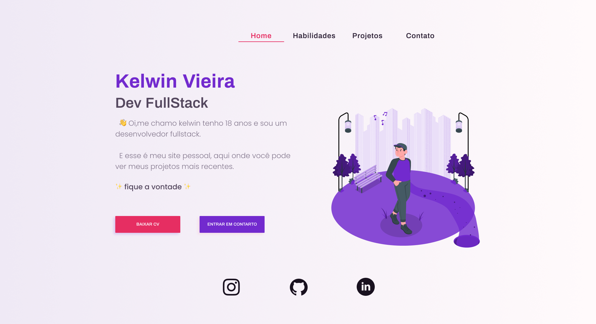

<h1 align="center">
  
  MEU PORTIFOLIO
</h1>

<p align="center">
  Você pode ver o projeto no ar clicando
  <a href="https://kelwin.vercel.app">aqui</a>
</p>

<p align="center">
  
</p>

<br/>
<br/>

# Sobre

Portfólio pessoal em Next.js com seções de experiência, impacto, skills, projetos corporativos e pessoais, formação e contato.

# Tecnologias

- [Next.js](https://nextjs.org)
- [Tailwind CSS](https://tailwindcss.com/)
- [Jest](https://jestjs.io/)
- [Cypress](https://www.cypress.io/)

# Cursor Skills

Skills do projeto em `.cursor/skills/` para planejar, avaliar e melhorar o portfólio.

## Fluxo recomendado

```text
migrate-figma-portfolio (plano) → portfolio-fullstack-content → portfolio-ui-polish → portfolio-recruiter-review
```

| Skill                           | Propósito                                                                                                                   | Como invocar                                  |
| ------------------------------- | --------------------------------------------------------------------------------------------------------------------------- | --------------------------------------------- |
| **migrate-figma-portfolio**     | Plano de migração do `portifolio-gerado` para este repo                                                                     | `aplicar migrate-figma-portfolio`             |
| **portfolio-fullstack-content** | Questionário + copy full stack (backend/infra), cases iFollow/Grupo Prime, curadoria de projetos                            | `aplicar portfolio-fullstack-content`         |
| **portfolio-ui-polish**         | UI: hero decorado, mobile nav, animações sutis, referência [figma-conversion](https://figma-conversion.vercel.app/services) | `aplicar portfolio-ui-polish` (após conteúdo) |
| **portfolio-recruiter-review**  | 3 avaliações de recrutadores + síntese comparativa                                                                          | `aplicar portfolio-recruiter-review`          |

### Detalhes

- **migrate-figma-portfolio:** `/home/kel/www/portifolio/.cursor/skills/migrate-figma-portfolio/` — plan-only, não implementa.
- **portfolio-fullstack-content:** `/home/kel/www/portifolio/.cursor/skills/portfolio-fullstack-content/` — executável; questionário obrigatório antes de editar.
- **portfolio-ui-polish:** `/home/kel/www/portifolio/.cursor/skills/portfolio-ui-polish/` — executável; não altera copy; manter paleta roxo/rosa.
- **portfolio-recruiter-review:** `/home/kel/www/portifolio/.cursor/skills/portfolio-recruiter-review/` — avaliar UX do código em `app/page.tsx` por padrão.
